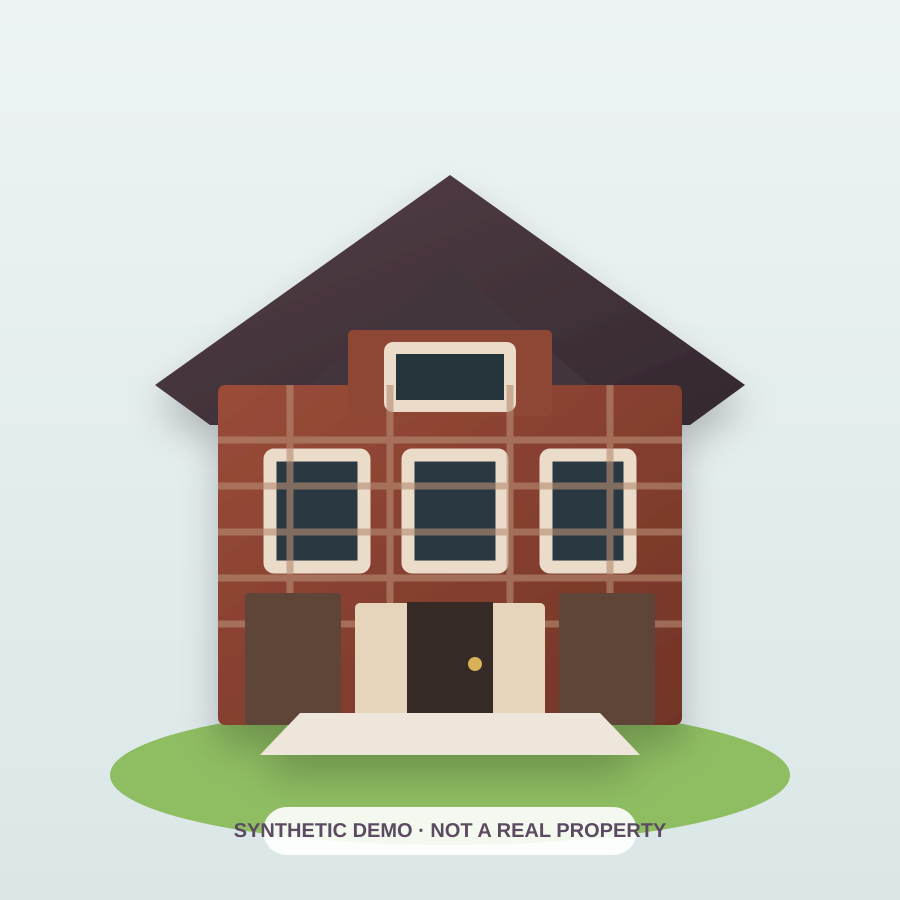

# Voxel Vault

**Turn an authorized house photo into a 3D preview, approve it, create a movable VoxelPop voxel, save it to World/Vault, and optionally mint the finished digital voxel.**

- Production: **https://voxelvault.io**
- Public no-login sample: **https://voxelvault.io/demo**
- Core creator: **https://voxelvault.io/property**



> The sample above is synthetic. It is not a customer upload or a real property.

## What ships to users now

### Core consumer flow

```text
PUBLIC SAMPLE (no login)
  -> SIGN IN
  -> AUTHORIZED PROPERTY PHOTO
  -> $4.99 DIGITAL CREATION CHECKOUT
  -> 3D PREVIEW
  -> USER REVIEW / APPROVAL
  -> MOVABLE VOXEL 3D
  -> WORLD + VAULT
  -> OPTIONAL MINT
```

The current Property flow is designed so that:

- one **$4.99** payment buys one digital VoxelPop property creation;
- the user sees the 3D preview before continuing to the separate voxel stage;
- the normal property creator keeps the source photo on-device through checkout/creation;
- normal property creation does **not** require Meshy credits;
- source-backed map/building data is a separate place-data layer;
- Vault/account sync problems must not turn a successful local creation into a dead end;
- minting is optional and comes after the digital voxel is ready.

A single photo can guide the visible appearance. It is **not** treated as a survey, architectural measurement, guaranteed full physical replica, title record, ownership record, or property valuation.

## Four product states

| State | Meaning |
| --- | --- |
| **$4.99 DIGITAL** | One paid VoxelPop digital creation. No physical-property rights. |
| **DEMO** | Sandbox/sample only. Demo credit is not money and creates no property rights. |
| **PARTNER** | A financial/investment action can be live only through the required approved provider, eligibility, settlement, disclosure and verification path. |
| **TITLE** | Real-property ownership changes only through ordinary closing and recorded title. |

**Digital model ≠ map evidence ≠ wallet/NFT record ≠ deed/title.**

## Main routes

| Route | Purpose |
| --- | --- |
| `/` | Focused VoxelPop product landing page |
| `/demo` | Public synthetic interactive 3D sample; no login or payment |
| `/property` | Paid property-photo → 3D preview → voxel journey |
| `/world` | Private/public saved voxel locations and source-backed map context |
| `/vault` | Saved properties, purchased digital twins, 3D creations and optional mint paths |
| `/more` | Optional digital tools plus explicitly separated advanced/provider-gated tools |
| `/about` | Product explanation and public support path |
| `/privacy` | Current privacy architecture |
| `/terms` | Current digital-creation and rights boundaries |

## Tech stack

- **Next.js 16 / React 19** — application shell and server routes
- **Three.js** — interactive local voxel and map/world rendering
- **Stripe** — explicit paid creation and other checkout flows
- **Supabase** — authentication and account-linked persistence
- **ethers / Hardhat** — optional blockchain/testnet infrastructure
- **Vercel** — production deployment

## Architecture at a glance

```text
Authorized photo
   |
   | browser/device-local creation path
   v
3D preview  --->  movable local voxel
                       |
                       +----> account/Vault record
                       |
Address  ---> map/geocoding/source-backed building context
                       |
                       +----> My World
                       |
                       +----> optional wallet/mint action

Separate advanced rails:
provider-backed investments / money movement / real-property title
```

The visual model and the mapped place are intentionally different evidence layers. The app should never infer physical ownership from a photo, map footprint, payment, voxel, NFT, wallet connection, or Property Passport alone.

## $1.99 Property Sandbox

The `$1.99 Property Sandbox` uses refillable fake demo credit and proportional comparison math. Demo credit is not cash, a deposit, a payment method, an investment account, or equity.

The sandbox does not transfer customer money, reserve real property, purchase a security, create equity, mint a real-estate security, or create deed, rent, occupancy, or appreciation rights.

## Real estate and money features

- **Property investments** — fail closed unless an approved provider supports the exact offering, user, eligibility, transaction, settlement and verification path.
- **Income** — only observed/provider-reported payments should be shown as actual income.
- **Direct ownership** — requires normal diligence, closing and recorded title.
- **Crypto / USD rails** — require the appropriate wallet, banking/payment, exchange, custody and compliance providers before customer money movement becomes live.

Voxel Vault is **not itself a bank, broker, exchange, custodian, escrow service, or deed registry**.

## Privacy posture

The core property flow is designed around a device-local source photo. Stripe handles payment processing; Supabase supports sign-in/account sync; map services may process a user-entered address when the user asks to map a property. Optional wallet, blockchain, AI, marketplace or provider-gated routes can use additional third parties and remain separate from the normal Property creation path.

Never commit private keys, passwords, payment-card data, identity documents, bank information, tenant PII, private deeds/leases, account tokens or private closing documents to this public repository or token metadata.

## Safety posture

- Paid VoxelPop creation is explicitly a **digital-creation purchase**.
- The public demo uses synthetic content.
- The $1.99 sandbox is fake demo credit only.
- Map evidence is not converted into an ownership claim.
- Wallet holdings, provider positions, property title and digital collectibles remain separate records.
- Public minting and regulated features remain fail-closed unless their specific requirements are met.
- A blockchain token does not replace a county deed or ordinary land-title system.

## Local verification

```bash
npm install
npm run test:property-platform
npm run test:simple-property-world
npm run build
```

## Contributing / public bug reports

Use GitHub Issues for reproducible public bugs and product feedback. **Do not** include passwords, private keys, payment details, identity documents, deeds, leases, private account tokens or other sensitive information in a public issue.

This repository does not currently publish a software license. A license should be chosen intentionally before presenting the repository as an open-source project.

For regulated-pilot architecture and launch gates, see `docs/REAL_ESTATE_PILOT.md`, `docs/UNIFIED_PROPERTY_MONEY_VAULT.md`, and the legal-review documentation under `docs/`.
